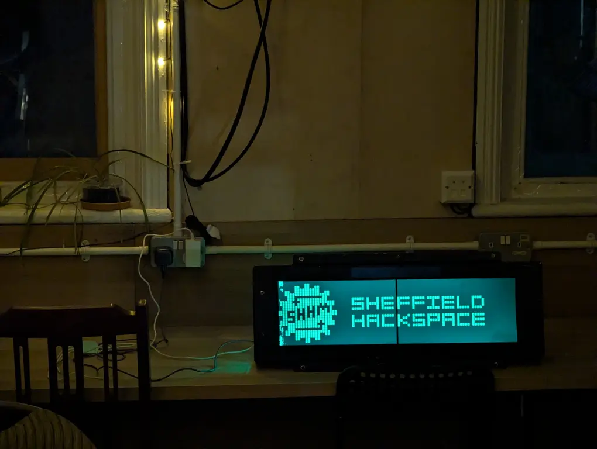

# sign controller

content cycler for <https://github.com/sheffieldhackspace/train-signs>



to run:

```bash
cp .env.example .env
nano .env
./run.sh
```

## set up on Pi server

```bash
# generate key
ssh-keygen -f /usr/shhm/.ssh/trainsigncontroller-deploy-key
# upload to GitHub as deploy key
cat /usr/shhm/.ssh/trainsigncontroller-deploy-key.pub

# to-do: make systemd service file
echo "er, yes"
```

update

```bash
./update_from_git.sh
# to-do: restart service
```

## to-do

examples of instant events

- (MQTT A) door A has been opened (image/anim/text)
- (MQTT A) door A has been closed (image/anim/text)
- (NP1) intercom rung (not yet on MQTT)

examples of a content cycle (sent as web requests from other device)

- (GRF1) current temperature (⁰C)
- (GRF1) current internet usage (kB /s)
- (GRF1) current power usage (W)
- (FTBL) next football game (datetime)
- (WEA) weather (see https://github.com/alifeee/weather_landscape/) (image)
- (ART) SHHM logo animation (image/anim)
- (OJ) 3D printer progress bar? from Octoprint (image/text)
- (WIKI) current membership numbers

MQTT A
: listen for MQTT messages. spec here
: <https://github.com/sheffieldhackspace/space-state-visualiser/blob/5692f13d855bc1f7fa9d57666e8374df0841ac5a/listeners.json#L8-L14>

NP1
: not possible unless Phil/Paul attaches intercom buzzer to MQTT (quite possible via isolated switch)

GRF1
: available via appropriate curl request to InfluxDB/Grafana
: <https://wiki.sheffieldhackspace.org.uk/members/projects/monitoring>

FTBL
: custom parsing of webpage similar to <https://github.com/sheffieldhackspace/football-fixtures-webhook>

WEA
: for textual weather description, I think some (MET?) APIs include a textual weather forecast field
: for image, see link above in original list item

ART
: you'd just make this as an image/gif 

OJ
: no idea how to do this, but presumably it's simple enough using an API request. would have to check if printer is on or not before sending request, lest it timeout

WIKI
: curl the wiki and use `hxselect` ;] - hope the format doesnt' change :]
