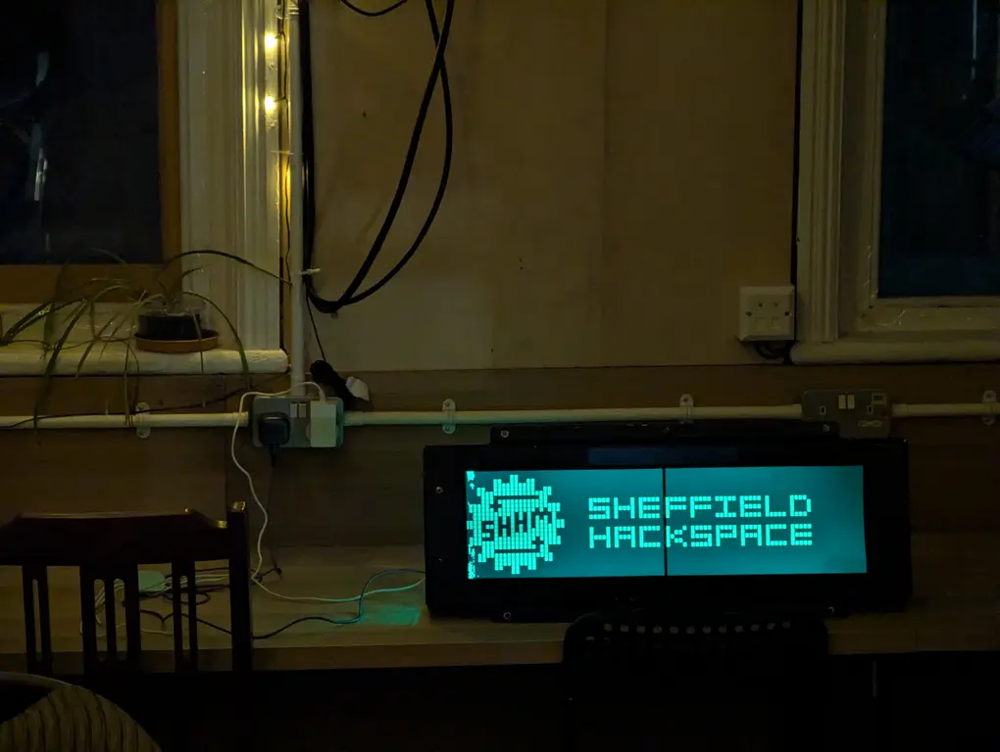

# sign controller

content cycler for <https://github.com/sheffieldhackspace/train-signs>



to run:

```bash
cp .env.example .env
nano .env
./run.sh
```

## set up on Pi server

```bash
# generate key
ssh-keygen -f /usr/shhm/.ssh/trainsigncontroller-deploy-key
# upload to GitHub as deploy key
cat /usr/shhm/.ssh/trainsigncontroller-deploy-key.pub
# create user
sudo useradd -r -s /bin/false trainsign
# install packages
sudo apt install gawk curl html-xml-utils python3 python3-pil imagemagick
# to-do: make systemd service file
sudo cp train-sign-controller.service /etc/systemd/system/
sudo systemctl enable train-sign-controller
sudo systemctl start train-sign-controller
sudo systemctl status train-sign-controller
```

update

```bash
./update_from_git.sh
# to-do: restart service
```

## to-do

examples of instant events

- (MQTT A) door A has been opened (image/anim/text)
- (MQTT A) door A has been closed (image/anim/text)
- (NP1) intercom rung (not yet on MQTT)

examples of a content cycle (sent as web requests from other device)

- (GRF1) current temperature (⁰C)
- (GRF1) current internet usage (kB /s)
- (GRF1) current power usage (W)
- (OJ) 3D printer progress bar? from Octoprint (image/text)
- total repair café repairs

MQTT A
: listen for MQTT messages. spec here
: <https://github.com/sheffieldhackspace/space-state-visualiser/blob/5692f13d855bc1f7fa9d57666e8374df0841ac5a/listeners.json#L8-L14>

NP1
: not possible unless Phil/Paul attaches intercom buzzer to MQTT (quite possible via isolated switch)

GRF1
: available via appropriate curl request to InfluxDB/Grafana
: <https://wiki.sheffieldhackspace.org.uk/members/projects/monitoring>

OJ
: no idea how to do this, but presumably it's simple enough using an API request. would have to check if printer is on or not before sending request, lest it timeout
